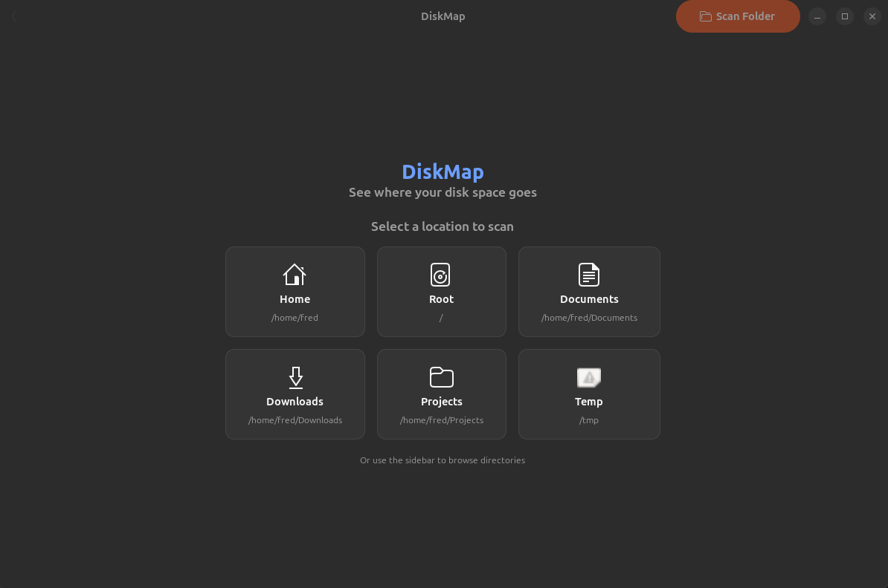
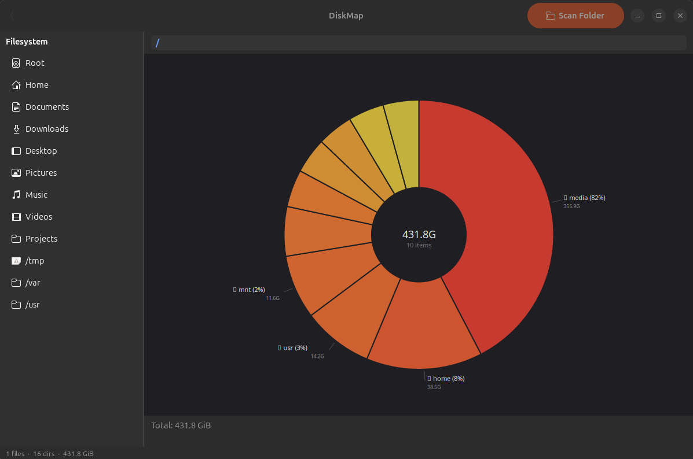

# DiskMap

A visual disk space analyzer with native UI on Linux (GTK4 + libadwaita) and macOS (SwiftUI).

Scan any directory and see where your space is going as an interactive donut pie chart. Drill into subdirectories, identify large files, and clean up with a right-click.

## Features

- **Pie chart visualization** with heat-map coloring (red = largest, blue = smallest)
- **Single-level scan** — scans one directory at a time for instant results
- **Drill-down navigation** — double-click a directory to scan into it, mouse back button or toolbar to go back
- **Right-click context menu** — Open in File Manager, Copy Path, Move to Trash
- **Virtual filesystem filtering** — automatically skips `/proc`, `/sys`, `/dev`, `/run`
- **Per-directory size timeout** — large directories won't hang the UI
- **Directory tree sidebar** — quick-access to common locations (Home, /, Documents, etc.)
- **Sqrt-scaled slices** — small items are always visible, not hidden by one large file

## Screenshots

### Welcome Screen


### Disk Scan


## Building

### Linux (GTK4)

Requires GTK4 and libadwaita development libraries:

```bash
# Debian/Ubuntu
sudo apt install libgtk-4-dev libadwaita-1-dev

# Fedora
sudo dnf install gtk4-devel libadwaita-devel

# Arch
sudo pacman -S gtk4 libadwaita
```

Build and run:

```bash
cd diskmap
cargo run -p dm-gtk
```

Release build:

```bash
cargo build --release -p dm-gtk
./target/release/diskmap
```

### macOS (SwiftUI)

Requires Rust and Xcode.

```bash
cd diskmap

# Build the universal Rust library (arm64 + x86_64)
bash scripts/build-rust-universal.sh

# Open in Xcode and build, or use xcodebuild
```

## Installing

### Debian/Ubuntu (.deb)

Download the `.deb` from [Releases](../../releases) or build it:

```bash
cargo install cargo-deb
cargo deb -p dm-gtk
sudo dpkg -i target/debian/diskmap_*.deb
```

### Flatpak

Download the `.flatpak` from [Releases](../../releases) or build it:

```bash
cd packaging
flatpak-builder --force-clean --repo=repo builddir com.diskmap.app.yml
flatpak build-bundle repo diskmap.flatpak com.diskmap.app
flatpak install diskmap.flatpak
```

### Binary

Download the `diskmap` binary from [Releases](../../releases), make it executable, and run. Requires GTK4 and libadwaita installed on your system.

## Architecture

```
diskmap/
  crates/
    dm-core/     # Data model, treemap algorithm, color mapping, analysis
    dm-scan/     # Single-level filesystem scanner with dir size computation
    dm-ffi/      # C-ABI static library for Swift (cbindgen)
    dm-gtk/      # GTK4 + libadwaita Linux app
  macos/
    Sources/     # SwiftUI macOS app
    RustCore/    # Swift package wrapping the C FFI library
  packaging/     # .desktop, icon, AppStream metadata, Flatpak manifest
```

The Rust core (`dm-core`, `dm-scan`) is shared between platforms. The GTK app uses the crates directly. The macOS app calls into Rust via a C FFI layer (`dm-ffi`).

## License

Copyright (c) 2026 Finn Devs LLC. All rights reserved.

This software is proprietary. No permission is granted to copy, modify, distribute, or use commercially without explicit written consent from Finn Devs LLC.

For licensing inquiries visit [finndevs.com](https://finndevs.com).
